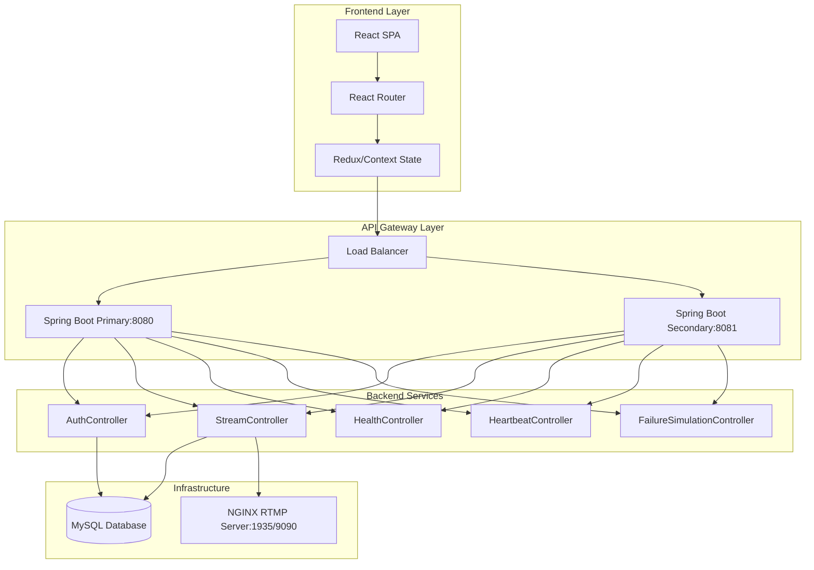

 # Design Document

## Overview

The streaming frontend will be a modern, responsive web application that provides an intuitive interface for the existing fault-tolerant streaming service. The frontend will be built as a single-page application (SPA) using React with TypeScript, providing real-time updates and seamless user experience. The application will integrate with the existing Spring Boot backend services through REST APIs and provide visual feedback on system health and streaming status.

The frontend will be containerized and deployed alongside the existing services, with load balancing and fault tolerance provided by the same Docker Swarm infrastructure.

## Architecture

### High-Level Architecture



### Technology Stack

- **Frontend Framework**: React 18 with TypeScript
- **State Management**: React Context API with useReducer
- **Routing**: React Router v6
- **HTTP Client**: Axios with interceptors for error handling
- **UI Components**: Custom components with CSS Modules
- **Build Tool**: Vite for fast development and optimized builds
- **Containerization**: Docker with multi-stage builds
- **Deployment**: Docker Compose integration with existing services

## Components and Interfaces

### Core Components

#### 1. App Component
- **Purpose**: Root component managing global state and routing
- **Responsibilities**: 
  - Initialize application state
  - Handle global error boundaries
  - Provide theme and configuration context
  - Manage authentication state

#### 2. Registration Component
- **Purpose**: User registration form with validation
- **Props**: None (uses global state)
- **State**: Form data, validation errors, submission status
- **API Integration**: POST `/api/auth/register`

#### 3. StreamKeyDisplay Component
- **Purpose**: Display stream key with copy functionality and setup instructions
- **Props**: `streamKey: string`, `username: string`
- **Features**: 
  - Copy-to-clipboard functionality
  - Tabbed interface for different streaming software
  - RTMP URL generation

#### 4. SystemStatus Component
- **Purpose**: Real-time system health monitoring
- **State**: System status, replica health, last update timestamp
- **API Integration**: 
  - GET `/heartbeat/status` (polling every 30 seconds)
  - GET `/health/status`
  - GET `/health/replicas`

#### 5. StreamTest Component
- **Purpose**: Stream connection testing functionality
- **Props**: `streamKey: string`
- **API Integration**: POST `/api/stream/start` for validation

#### 6. AdminPanel Component
- **Purpose**: Administrative interface for system monitoring
- **Features**: 
  - Failure simulation controls
  - Detailed system metrics
  - User registration logs
- **API Integration**: All `/simulation/*` endpoints

### API Service Layer

#### ApiClient Class
```typescript
class ApiClient {
  private baseURL: string;
  private timeout: number;
  
  constructor(baseURL: string, timeout = 10000);
  
  // Registration
  async register(userData: RegisterRequest): Promise<RegisterResponse>;
  
  // Stream management
  async validateStreamKey(streamKey: string): Promise<boolean>;
  async startStream(streamKey: string): Promise<void>;
  async stopStream(streamKey: string): Promise<void>;
  
  // System health
  async getSystemStatus(): Promise<SystemStatus>;
  async getHeartbeatStatus(): Promise<HeartbeatStatus>;
  async getReplicaHealth(): Promise<ReplicaHealth[]>;
  
  // Failure simulation (admin)
  async enableSimulation(): Promise<void>;
  async disableSimulation(): Promise<void>;
  async simulateFailure(replicaUrl: string): Promise<void>;
  async recoverReplica(replicaUrl: string): Promise<void>;
}
```

### State Management

#### Application State Structure
```typescript
interface AppState {
  user: {
    isRegistered: boolean;
    username: string | null;
    streamKey: string | null;
  };
  system: {
    status: 'operational' | 'degraded' | 'down';
    replicas: ReplicaStatus[];
    lastUpdate: Date;
  };
  ui: {
    loading: boolean;
    error: string | null;
    notifications: Notification[];
  };
}
```

## Data Models

### Frontend Data Models

#### RegisterRequest
```typescript
interface RegisterRequest {
  username: string;
  password: string;
  confirmPassword: string;
  email: string;
}
```

#### RegisterResponse
```typescript
interface RegisterResponse {
  username: string;
  streamKey: string;
}
```

#### SystemStatus
```typescript
interface SystemStatus {
  system_status: 'operational' | 'degraded' | 'down';
  healthy_replicas: number;
  total_replicas: number;
  primary_replica: string;
  primary_replica_index: number;
}
```

#### ReplicaStatus
```typescript
interface ReplicaStatus {
  status: 'UP' | 'DOWN';
  url: string;
  is_primary: boolean;
  consecutive_failures: number;
  consecutive_successes: number;
  last_checked: string;
}
```

#### StreamingInstructions
```typescript
interface StreamingInstructions {
  software: 'obs' | 'ffmpeg' | 'other';
  rtmpUrl: string;
  streamKey: string;
  settings: {
    [key: string]: string | number;
  };
}
```

## Error Handling

### Error Handling Strategy

1. **API Error Handling**
   - HTTP status code mapping to user-friendly messages
   - Retry logic for transient failures
   - Fallback to secondary replica on primary failure
   - Network timeout handling

2. **Form Validation**
   - Real-time validation with debouncing
   - Server-side validation error display
   - Field-level error messaging

3. **System Status Errors**
   - Graceful degradation when health endpoints are unavailable
   - Cached status display during network issues
   - Clear error messaging for system outages

### Error Boundary Implementation
```typescript
class ErrorBoundary extends React.Component {
  // Catch JavaScript errors in component tree
  // Display fallback UI with error reporting
  // Provide recovery options
}
```

## Testing Strategy

### Unit Testing
- **Framework**: Jest with React Testing Library
- **Coverage**: All components, hooks, and utility functions
- **Mocking**: API calls, localStorage, clipboard API

### Integration Testing
- **API Integration**: Test all API service methods
- **Component Integration**: Test component interactions
- **State Management**: Test state updates and side effects

### End-to-End Testing
- **Framework**: Playwright or Cypress
- **Scenarios**: 
  - Complete user registration flow
  - Stream key generation and display
  - System status monitoring
  - Error handling scenarios

### Performance Testing
- **Bundle Size**: Monitor and optimize bundle size
- **Load Testing**: Test with multiple concurrent users
- **Accessibility**: WCAG 2.1 compliance testing

## Deployment Architecture

### Docker Configuration

#### Multi-stage Dockerfile
```dockerfile
# Build stage
FROM node:18-alpine AS builder
WORKDIR /app
COPY package*.json ./
RUN npm ci --only=production
COPY . .
RUN npm run build

# Production stage
FROM nginx:alpine
COPY --from=builder /app/dist /usr/share/nginx/html
COPY nginx.conf /etc/nginx/nginx.conf
EXPOSE 80
CMD ["nginx", "-g", "daemon off;"]
```

#### Docker Compose Integration
- Add frontend service to existing `compose.yaml`
- Configure reverse proxy through NGINX
- Environment variable configuration for API endpoints
- Health checks and restart policies

### Load Balancing and Fault Tolerance

1. **Frontend Redundancy**
   - Multiple frontend container replicas
   - NGINX load balancing between frontend instances
   - Static asset caching and CDN integration

2. **API Failover**
   - Automatic failover between Spring Boot replicas
   - Circuit breaker pattern for API calls
   - Graceful degradation during backend failures

3. **Monitoring Integration**
   - Health check endpoints for frontend containers
   - Integration with existing heartbeat monitoring
   - Metrics collection for frontend performance

## Security Considerations

### Frontend Security
- **Input Validation**: Client-side validation with server-side verification
- **XSS Prevention**: Proper data sanitization and CSP headers
- **CSRF Protection**: Integration with Spring Security CSRF tokens
- **Secure Communication**: HTTPS enforcement and secure headers

### API Security
- **Authentication**: Integration with existing Spring Security
- **Authorization**: Role-based access for admin features
- **Rate Limiting**: Protection against abuse and DoS attacks
- **CORS Configuration**: Proper cross-origin resource sharing setup

## Performance Optimization

### Frontend Performance
- **Code Splitting**: Route-based and component-based code splitting
- **Lazy Loading**: Lazy load non-critical components
- **Caching**: Aggressive caching of static assets
- **Bundle Optimization**: Tree shaking and minification

### API Performance
- **Request Optimization**: Batch API calls where possible
- **Caching**: Client-side caching of system status data
- **Polling Optimization**: Intelligent polling with backoff strategies
- **Connection Pooling**: Reuse HTTP connections for API calls

## Monitoring and Observability

### Frontend Monitoring
- **Error Tracking**: Integration with error reporting service
- **Performance Metrics**: Core Web Vitals monitoring
- **User Analytics**: Usage patterns and feature adoption
- **Real User Monitoring**: Performance in production environment

### Integration Monitoring
- **API Response Times**: Track backend API performance
- **Error Rates**: Monitor API error rates and types
- **System Health**: Display real-time system status
- **Alerting**: Notifications for critical system issues