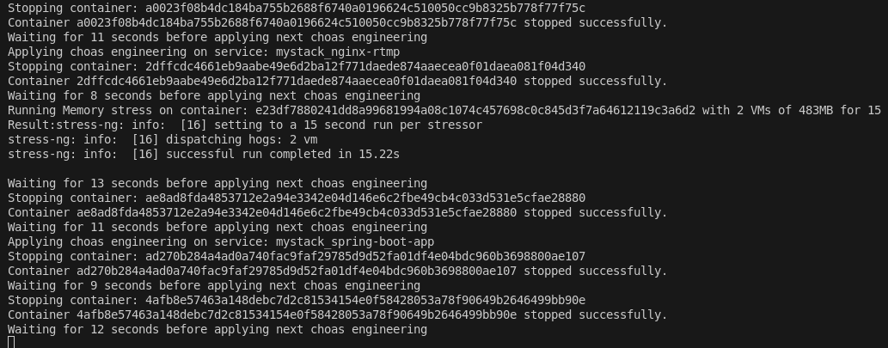
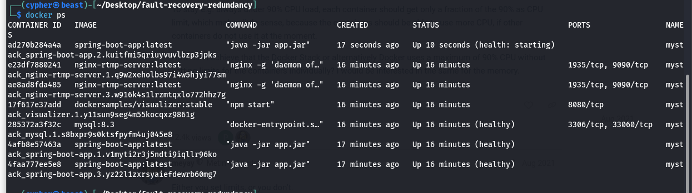
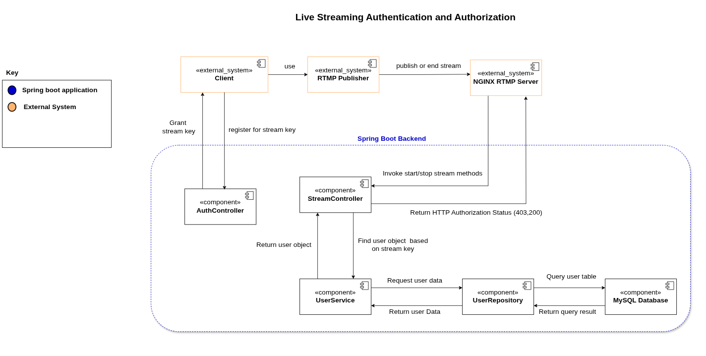
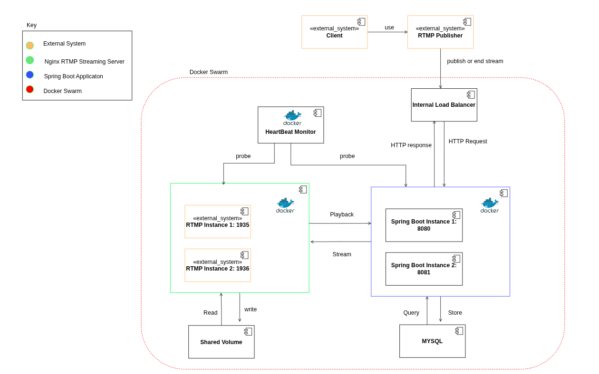
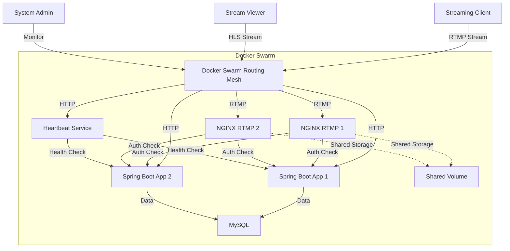
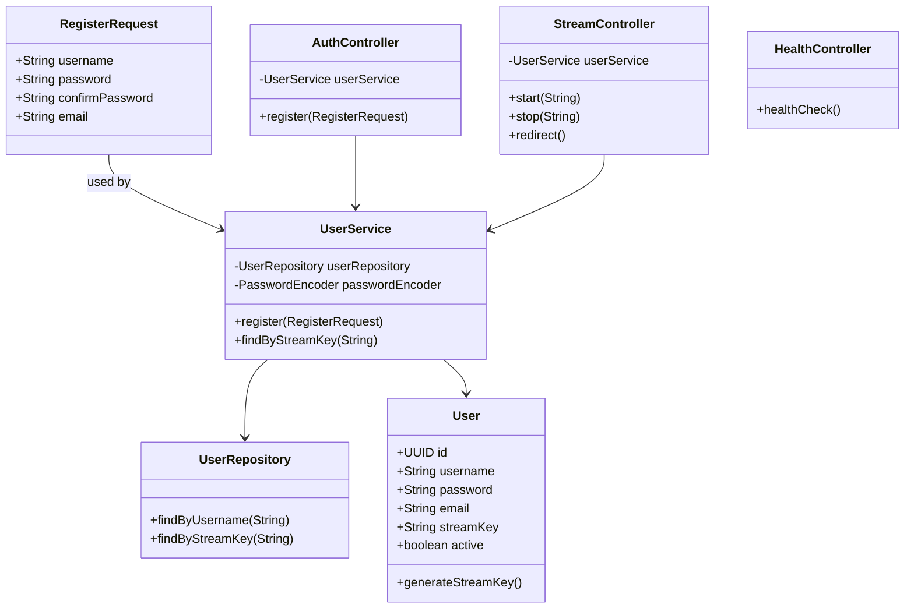
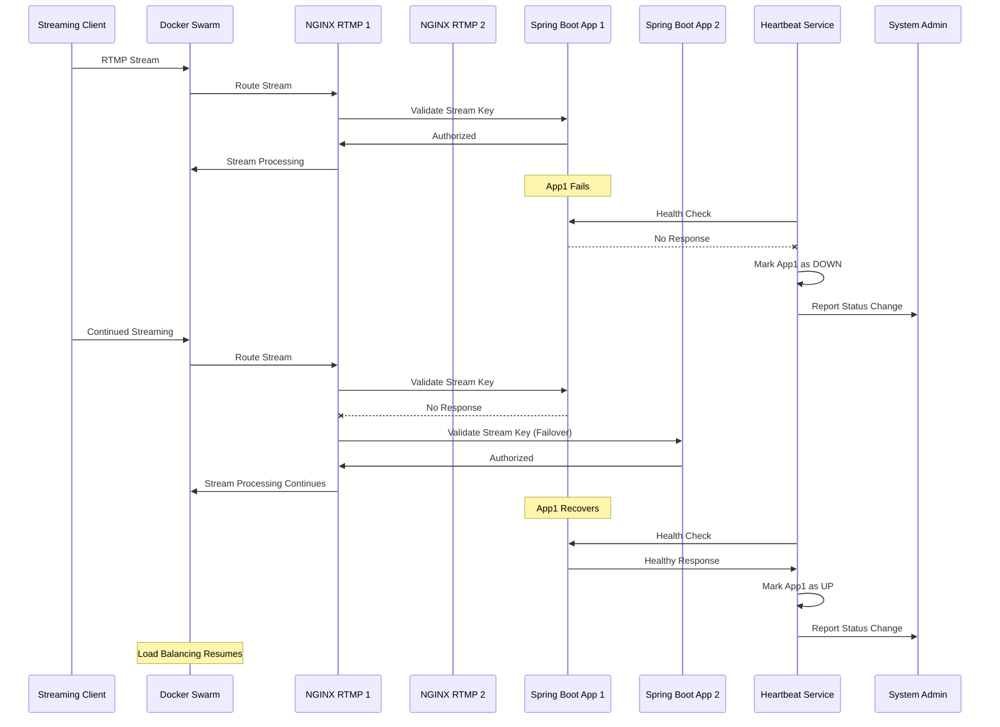

# Fault-Tolerant Livestreaming Authentication System

## Table of Contents

- [Overview](#overview)
- [Goals](#goals)
- [Technologies](#technologies)
- [Project Structure](#project-structure)
- [Deploy via Docker Swarm](#deploy-via-docker-swarm)
- [Heartbeat Monitoring](#heartbeat-monitoring)
- [Chaos Simulation](#chaos-simulation)
- [Sample Outputs](#sample-outputs)
- [Test the System](#test-the-system)
- [Architecture](#architecture)
  - [Legacy Architecture](#legacy-architecture)
  - [Extended Fault-Tolerant Architecture](#extended-fault-tolerant-architecture)
  - [Mermaid: Deployment Components](#mermaid-deployment-components)
- [Class Diagram](#class-diagram)
- [Sequence Diagram](#sequence-diagram)
- [Security Tactics](#security-tactics)
- [API Endpoints](#api-endpoints)
- [Cleanup](#cleanup)

---

## Overview

This project enhances the [authentication and authenticate livestreaming system](https://github.com/ajbarea/authentication-and-authorization) by introducing redunancy and fault recovery using container replication and monitoring. The system features:

- **Spring Boot** service for authentication and stream key management  
- **NGINX RTMP** server for ingesting livestreams  
- **.NET-based Heartbeat Monitor** for real-time health checks  
- **Chaos Injection Tool** (C#) to test system resilience  
- **Docker Swarm** to orchestrate and replicate services  

---

## Goals

- Ensure continuous uptime for authentication and streaming services  
- Minimize downtime using replication and Swarm failover  
- Monitor service health and log failures/restarts  
- Validate resilience through chaos engineering  

---

## Technologies

- **Java (Spring Boot)** – Auth service API and Streaming key Authentication 
- **NGINX RTMP** – Livestream input & HLS output  
- **C# / .NET Core** – Heartbeat Monitor & Chaos Testing  
- **MySQL** – User information and streaming keys
- **Docker Swarm** – Orchestration and load balancing  
- **ffmpeg / OBS** – Streaming input  
- **Docker.DotNet** – .NET API to interact with Docker /  Docker Swarm

---

## Project Structure

```
├── app/              # Spring Boot Auth service
├── choas/            # Chaos engineering simulation (C#)
├── monitor/          # Heartbeat monitor (C#)
├── nginx-rtmp/       # NGINX RTMP config + Dockerfile
├── docker-stack.yml  # Full swarm deployment
├── compose.yaml      # Local dev (optional)
├── docs/             # Architecture & test screenshots
```

---

## Deploy via Docker Swarm

### 1. Build Images

```bash
docker build -t spring-boot-app:latest ./app
docker build -t nginx-rtmp-server:latest ./nginx-rtmp
```

### 2. Initialize Swarm (if needed)

```bash
docker swarm init
```

### 3. Deploy Stack

```bash
docker stack deploy -c docker-stack.yml mystack
```

Check all replicas are up:

```bash
docker service ls
```

---

## Heartbeat Monitoring

The monitor service:

- Checks Spring Boot and RTMP replicas  
- Uses Docker.DotNet to detect container status  
- Reports container restarts, up/down transitions  
- Logs status continuously

1. Change directory into the monitor folder
```bash
   cd monitor
```

2. Run the heartbeat monitoring system
```bash
   dotnet run
```

---

## Chaos Simulation

The `choas` tool simulates service failure scenarios:

- Stops containers  
- Disrupts networks  
- Stresses CPU or memory  
- Injects latency or kills the RTMP/auth stack  

### Run Chaos Test:

```bash
cd choas
dotnet run
```

---

## Sample Outputs

### Chaos Attack Log



### Container Recovery (via Docker Swarm)



---

## Test the System

### 1. Register a User

```bash
curl -X POST http://localhost:8080/api/auth/register \
  -H "Content-Type: application/json" \
  -d '{
    "username": "yolo2",
    "password": "supersecret",
    "confirmPassword": "supersecret",
    "email": "email@example.com"
  }'
```

### 2. Stream with OBS or ffmpeg

```bash
ffmpeg -f lavfi -i testsrc2=size=1280x720:rate=30 \
  -f lavfi -i sine=frequency=1000:sample_rate=44100 \
  -c:v libx264 -preset veryfast -c:a aac -f flv \
  rtmp://localhost/live/<your-stream-key>
```

### 3. View Stream (HLS)

```bash
http://localhost:9090/live/stream_<your-username>/index.m3u8
```

---

## Architecture

### Legacy Architecture



### Extended Fault-Tolerant Architecture



### Mermaid: Deployment Components



---

## Class Diagram



---

## Sequence Diagram



---

## Security Tactics

- Stream key-based authentication  
- NGINX `on_publish` and `on_publish_done` for stream auth  
- BCrypt password hashing  
- Auth service secured via Spring Security  
- HLS view is public; RTMP ingest is authenticated  

---

## API Endpoints

| Endpoint                  | Method | Description                           |
|--------------------------|--------|---------------------------------------|
| `/health`                | GET    | Basic system health check             |
| `/api/auth/register`     | POST   | Create new user + stream key          |
| `/api/stream/start`      | POST   | NGINX `on_publish` validation         |
| `/api/stream/stop`       | POST   | NGINX `on_publish_done` cleanup       |
| `/heartbeat/status`      | GET    | Get all replica statuses              |

---

## Cleanup

```bash
docker stack rm mystack
docker volume prune
```
