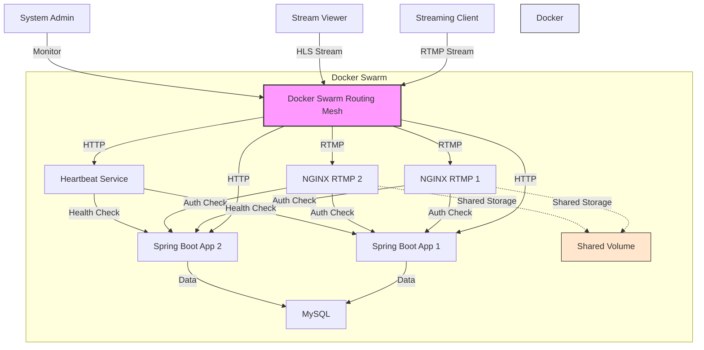
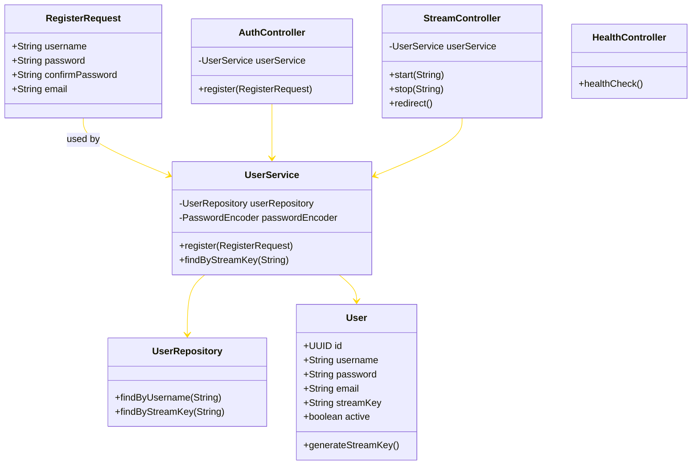
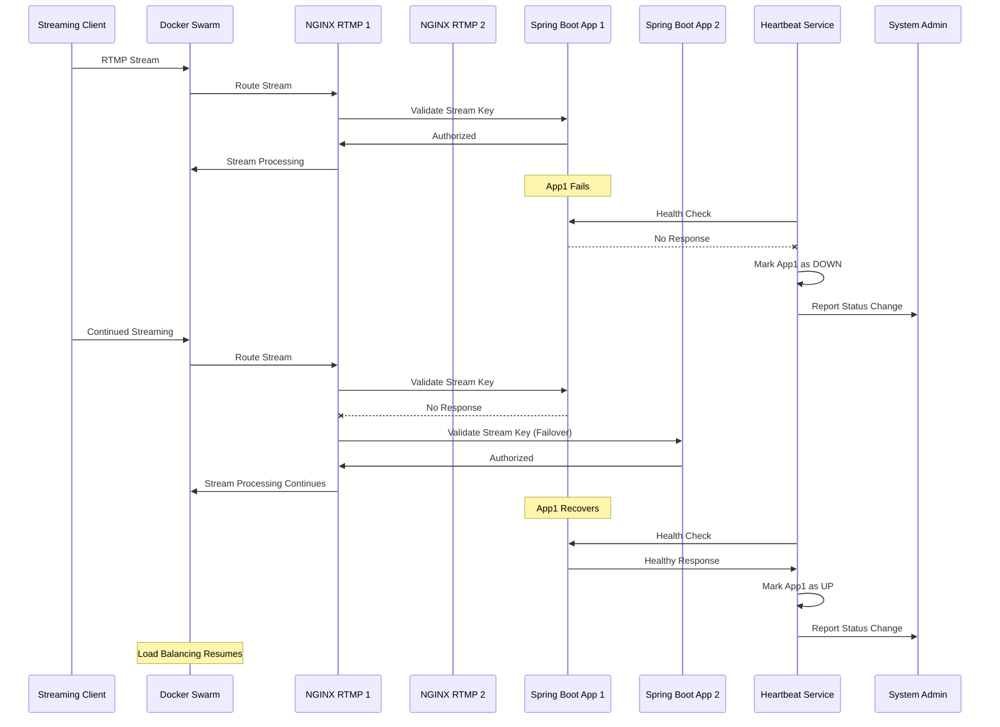

# Authentication and Authorization

## 🔒 Description


   This project extends the previous live streaming project that was built for the [authentication and authorization assignment](https://github.com/ajbarea/authentication-and-authorization)

   In this enhanced version, we extend the system to address non-functional requirements of availability and reliability by incorporating fault recovery and failover mechanisms. Specifically, the Spring Boot authentication service and NGINX RTMP live streaming server are now replicated across two nodes — a primary (active) and a secondary (standby) — deployed on separate containers in a shared network environment.

   A heartbeat monitor continuously probes both the active and standby services for their health status, showing when an instance goes down and another instance takes over.

### Goals

      - Ensure continuous uptime of the authentication and streaming services
      - Minimize downtime with automatic redirection and passive failover
      - Demonstrate fault tolerance using Docker Swarm and heartbeat monitoring

### Docker Swarm-Based Architecture

   To improve the system’s resilience and availability, we extend the architecture with passive failover and replication utilizing Docker Swarm. The reasons for choosing Docker Swarm include:

   - The original system already used `docker-compose.yaml` to launch services
   - Docker Swarm supports native service replication using the `replicas` key
   - Built-in load balancing and health checking capabilities reduce complexity

### Key Components

   - **Spring Boot Authentication Service (x2 replicas)**  
   Provides user authentication and authorization logic, replicated across two containers for failover.

   - **NGINX RTMP Streaming Server (x2 replicas)**  
   Handles RTMP ingest and video stream forwarding, deployed with redundancy.

   - **Docker Swarm Load Balancer**  
   Internal swarm routing ensures traffic is automatically redirected to healthy instances.

   - **Heartbeat Monitor**  
   A custom Java component that checks the health endpoints of each service and logs the status of active and standby nodes. It detects failures and logs failover activity.

### Fault Tolerance Strategy

- Docker Swarm ensures service-level replication with built-in health checks.
- If the primary container becomes unresponsive, Swarm redirects traffic to another healthy replica.
- The heartbeat monitor provides real-time insight into service health and failover events.

### Desired learning outcome

This extended version showcases how to take an existing microservice-based system and scale it with high availability and fault tolerance. It demonstrates that with minimal changes—thanks to Docker Swarm—services can be replicated and monitored, and failover mechanisms added without major refactoring.


## Architecture

### Recap of single instance Components Diagram 


### High Level extended Fault Recovery and Redudant Component Diagram


### Detailed extended Fault Recovery and Redudant Component Diagram


### Class Diagram



---
### Sequence Diagram


---

## 🚀 Getting Started

### Prerequisites

- Java 17+
- [Dotnet](https://dotnet.microsoft.com/en-us/) 
- Maven
- An IDE like IntelliJ IDEA or Eclipse
- Docker
- Streaming client, you can use OBS or ffmpeg on the CLI
- A Client to view the stream video, you may use VLC other players or use ffplay on the CLI

### Dependencies

The project is built using Docker Swarm which contains the following services:

- **Spring Boot**: The backend service (in `app/` directory) that handles authentication and authorization. It uses Spring Web, Spring Security, and Spring Data JPA.
- **MySQL**: The database for storing user credentials and stream keys
- **NGINX RTMP**: The media server (in `nginx-rtmp/` directory) that handles RTMP streaming and communicates with the Spring Boot service for stream authentication
- **Heartbeat Service**: A monitoring service that checks the health of all Spring Boot replicas and provides status information

---

## 🏗️ How to Run

### High Available with Docker Swarm

1. Clone the repository:

   ```bash
   git clone https://github.com/ajbarea/authentication-and-authorization.git
   cd authentication-and-authorization
   ```

2. Build the images:

   ```bash
   docker build -t spring-boot-app:latest ./app
   docker build -t nginx-rtmp-server:latest ./nginx-rtmp
   ```
3. Initalize Docker Swarm if not already initalized

   ```bash
   docker swarm init
   ```

4. Deploy the stack

   ```bash
   docker stack deploy -c docker-stack.yml mystack
   ```

   This will start:
   - **MySQL database** on port 3306
   - **NGINX RTMP server** on ports 1935 (RTMP)
   - **NGINX Server** on port 9090(HTTP)
   - **Spring Boot application** on port 8080 (HTTP)

5. Wait for all replicas to be up by checking
```bash
   docker service ls
```

3. Register for a streaming key by sending a POST request to `localhost:8080/api/auth/register`. There are many ways that you may do this.
   You may use Postman, Insomnia, etc., or a classic curl command:

   ```bash
   curl -X POST http://localhost:8080/api/auth/register \
     -H "Content-Type: application/json" \
     -d '{
       "username": "yolo2",
       "password": "mySuperSecret",
       "confirmPassword": "mySuperSecret",
       "email": "myEmail2@gmail.com"
     }'
   ```

   You should see a response similar to:

   ```json
   {
     "username": "yolo2",
     "streamKey": "generated-stream-key"
   }
   ```

4. Copy your stream key. You will need this to paste in obs or ffmpeg to start streaming.
5. Start streaming using your favorite streaming client (e.g., OBS, ffmpeg) with the RTMP URL:

   ```text
   rtmp://localhost/live
   ```

   In the stream key field, paste your generated stream key.

6. Click on start stream in OBS or run the following ffmpeg command:

   ```bash
   ffmpeg -f lavfi -i testsrc2=size=1280x720:rate=30 -f lavfi -i sine=frequency=1000:sample_rate=44100 -c:v libx264 -preset veryfast -c:a aac -f flv rtmp://localhost/live/<your-stream-key>
   ```

7. View the stream using a media player that supports HLS (e.g., VLC, ffplay) with the URL:

   ```text
   http://localhost:9090/live/stream_<your-username>/index.m3u8

   Example:
   http://localhost:9090/live/stream_yolo2/index.m3u8
   ```
---


## Fault recovery and redunancy tatic testings
In this project we utilized choas engineering that simulated the fault and attempt to take down the spring boot and nginx services 
using choas engineering techniques. Such techniques involves:
 - Stopping a container
 - Stopping the container's network
 - Introducing delay in the network
 - Max out the CPU resource
 - Max out the memory
 - Add delay in the network response
 - Running all stressor with multiple instances (stress-ng)

 The chaos testings are done by hooking into the docker container through docker's api and introduced the choas.

 To run the choas 
 1. Cd into the choas folder
 ```bash
   cd choas
```
2. Run the choas C# application - you need to download dotnet first in the dependency section
```bash
   dotnet run
```

## Sample output of Running the choas


In the above screenshot, we can see various chaos engineering method being employed to knock the service offline. 
If we look at the top, we can see the service got stopped

## Sample output of recovery through Docker Swarm

In this screenshot, we can see the container restarted after one of the replicas was killed

## Results from the heartbeat monitors
 - suggest implement a heartbeat monitor that monitor both services and their replications as well as their up and down status using the docker api in c#
 ```bash
 using Docker.DotNet;
using Docker.DotNet.Models;
```


## ✔️ Security Tactics Demonstrated

This project demonstrates the following security tactics in a real-world streaming context:

- **Authentication**: User registration and stream key generation for publisher identity verification
- **Authorization**: Stream-level access control using NGINX RTMP hooks and Spring Boot validation
- **Secure Integration**: Communication between NGINX RTMP and Spring Boot backend for real-time stream authorization
- **Database Security**: Secure storage of user credentials and stream keys using BCrypt password hashing in MySQL
- **Token-based Security**: Stream keys act as bearer tokens for publishing authorization
- **HLS Security**: Public access to HLS streams while maintaining publisher authentication

## 🔍 API Endpoints

| Endpoint | Method | Description | Authentication & Authorization Required |
|----------|--------|-------------|------------------------|
| `/` or `/health` | GET | Health check endpoint | ❌ No |
| `/api/auth/register` | POST | Register new user and generate stream key | ❌ No |
| `/api/stream/start` | POST | Validate stream key during NGINX on_publish (param: `name`) | ✅ |
| `/api/stream/stop` | POST | Validate stream key during NGINX on_publish_done (param: `name`) | ✅ |
| `/heartbeat/status` | GET | Get health status of all application replicas | ❌ No |

### Registration Request Format

```json
{
  "username": "your_username",
  "password": "your_password", 
  "confirmPassword": "your_password",
  "email": "your_email@example.com"
}
```

### Registration Response Format

```json
{
  "username": "your_username",
  "streamKey": "generated-16-char-key"
}
```

## 🧪 Testing

You can test the system by:

1. **Health Check**: Verify the application is running

   ```bash
   curl http://localhost:8080/health
   ```

2. **Registration**: Register a new user and receive a stream key

   ```bash
   curl -X POST http://localhost:8080/api/auth/register \
     -H "Content-Type: application/json" \
     -d '{
       "username": "testuser",
       "password": "testpass123",
       "confirmPassword": "testpass123", 
       "email": "test@example.com"
     }'
   ```

3. **Streaming**: Use the received stream key to publish via RTMP

   ```bash
   # Test with ffmpeg
   ffmpeg -f lavfi -i testsrc2=size=1280x720:rate=30 \
     -f lavfi -i sine=frequency=1000:sample_rate=44100 \
     -c:v libx264 -preset veryfast -c:a aac -f flv \
     rtmp://localhost:1935/live/YOUR_STREAM_KEY
   ```

4. **Authorization**: Try streaming with an invalid key (should be rejected)

5. **Viewing**: Access the stream via HLS without authentication

   ```bash
   # View with ffplay
   ffplay http://localhost:9090/live/stream_YOURUSERNAME/index.m3u8
   ```

## 📚 References

- [Spring Security Docs](https://docs.spring.io/spring-security/site/docs/current/reference/html5/)
- [Spring Initializr](https://start.spring.io)
- [Nginx RTMP module](https://github.com/mannyamorim/nginx-rtmp-module)
- [Nginx](https://docs.nginx.com/)
- [Building a live streaming system with Nginx By Ben Wilber](https://benwilber.github.io/nginx/rtmp/live/video/streaming/2018/03/25/building-a-live-video-streaming-website-part-1-start-streaming.html)

## 🔄 Redundancy & Heartbeat Monitoring

This project implements Docker Swarm-based redundancy with heartbeat monitoring to provide high availability and fault tolerance:

### Redundancy Features

- **Multiple Spring Boot Replicas**: The application runs with multiple replicas to ensure continuous service even if one instance fails
- **Docker Swarm Load Balancing**: Automatic distribution of traffic across healthy replicas
- **Automatic Failover**: If a replica fails its health check, Swarm automatically routes traffic to healthy replicas
- **Self-healing**: Failed containers are automatically restarted by Docker Swarm

### Heartbeat Monitoring

The heartbeat service provides real-time monitoring of all application replicas:

- **Periodic Health Checks**: Checks the health of all Spring Boot replicas every 10 seconds
- **Status Dashboard**: Exposes a `/heartbeat/status` endpoint that shows the current health of all replicas
- **Logging**: Logs health status changes with timestamps and replica identifiers

### Heartbeat Status Response Format

```json
{
  "system_status": "operational",
  "healthy_replicas": 2,
  "total_replicas": 2,
  "replicas": {
    "replica_0": {
      "status": "UP",
      "url": "http://spring-boot-app:8080/health"
    },
    "replica_1": {
      "status": "UP",
      "url": "http://spring-boot-app:8081/health"
    }
  }
}
```

### Testing Failover

You can test the failover capability by:

1. Check the current status of all replicas:
   ```bash
   curl http://localhost:8081/heartbeat/status
   ```

2. Simulate a failure by stopping one of the Spring Boot replicas:
   ```bash
   docker service scale streaming-auth_spring-boot-app=1
   ```

3. Check the heartbeat status again to see the change:
   ```bash
   curl http://localhost:8081/heartbeat/status
   ```

4. Verify that the streaming service continues to work despite the failure

5. Restore the full capacity:
   ```bash
   docker service scale streaming-auth_spring-boot-app=2
   ```