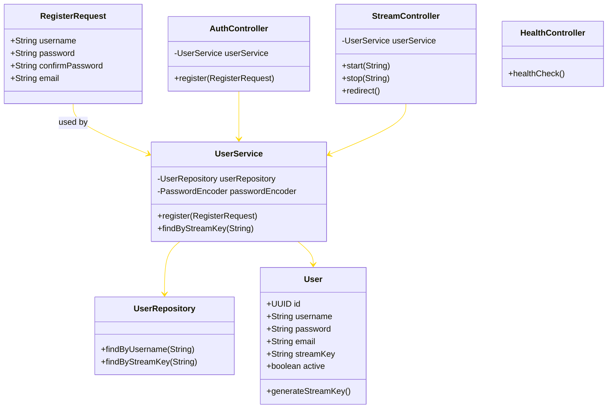

# Authentication and Authorization

## 🔒 Description

The motivation for this project is to demonstrate the implementation of **authentication and authorization architectural tactics** by integrating them into an existing technology — rather than building every component from scratch. Specifically, this prototype shows how to extend the functionality of the **NGINX RTMP module**, a lightweight media server, by connecting it to a **Spring Boot application** that enforces **secure streaming behavior**.

Instead of developing a full live streaming service, this project uses **NGINX RTMP** as an off-the-shelf solution for handling **RTMP stream ingestion and playback**. Through its built-in **on_publish** and **on_publish_done** hooks, NGINX communicates with a **Spring Boot backend** that validates whether a stream should be allowed based on the **stream key** provided.

The key requirement is that only **registered users with valid stream keys** are allowed to publish streams, while **viewers (the public) are not restricted from watching**. When a stream is started (**on_publish**), the Spring Boot service checks the key against a **MySQL-backed user database** and approves or rejects the request. When the stream ends (**on_publish_done**), the backend can optionally log or respond to the termination of the stream session.

This project demonstrates:

- The practical integration of multiple technologies to meet a specific **security requirement**
- How to use **authentication and stream-level authorization** in a working system
- How design decisions (like using **on_publish**) can be implemented and tested in a constrained, prototype setting

Ultimately, this project emphasizes the real-world relevance of integrating and extending existing components to meet system-specific goals, fulfilling the assignment’s objective of not just designing, but **implementing and validating architectural tactics**.

## Architecture

### Components Diagram


### Class Diagram



---

## 🚀 Getting Started

### Prerequisites

- Java 17+
- Maven
- An IDE like IntelliJ IDEA or Eclipse
- Docker
- Streaming client, you can use OBS or ffmpeg on the CLI
- A Client to view the stream video, you may use VLC other players or use ffplay on the CLI

### Dependencies

The project is built using Docker Swarm which contains the following services:

- **Spring Boot**: The backend service (in `app/` directory) that handles authentication and authorization. It uses Spring Web, Spring Security, and Spring Data JPA.
- **MySQL**: The database for storing user credentials and stream keys
- **NGINX RTMP**: The media server (in `nginx-rtmp/` directory) that handles RTMP streaming and communicates with the Spring Boot service for stream authentication
- **Heartbeat Service**: A monitoring service that checks the health of all Spring Boot replicas and provides status information

---

## 🏗️ How to Run

### Docker Compose (Single Node)

1. Clone the repository:

   ```bash
   git clone https://github.com/ajbarea/authentication-and-authorization.git
   cd authentication-and-authorization
   ```

2. Build the services using Docker Compose:

   ```bash
   docker compose up -d
   ```

   This will start:
   - **MySQL database** on port 3306
   - **NGINX RTMP server** on ports 1935 (RTMP) and 9090 (HTTP)
   - **Spring Boot application** on port 8080

### Docker Swarm (High Availability)

For production environments or to enable high availability with redundancy:

1. Initialize Docker Swarm (if not already initialized):

   ```bash
   docker swarm init
   ```

2. Build the images:

   ```bash
   docker build -t spring-boot-app:latest ./app
   docker build -t nginx-rtmp-server:latest ./nginx-rtmp
   ```

3. Deploy the stack:

   ```bash
   docker stack deploy -c docker-stack.yml streaming-auth
   ```

   This will start:
   - **MySQL database** (1 replica)
   - **NGINX RTMP server** (2 replicas) on ports 1935 (RTMP) and 9090 (HTTP)
   - **Spring Boot application** (2 replicas)
   - **Heartbeat service** (1 replica) on port 8081

4. Verify the services are running:

   ```bash
   docker service ls
   ```

5. Check the health status of all replicas:

   ```bash
   curl http://localhost:8081/heartbeat/status
   ```

3. Register for a streaming key by sending a POST request to `localhost:8080/api/auth/register`. There are many ways that you may do this.
   You may use Postman, Insomnia, etc., or a classic curl command:

   ```bash
   curl -X POST http://localhost:8080/api/auth/register \
     -H "Content-Type: application/json" \
     -d '{
       "username": "yolo2",
       "password": "mySuperSecret",
       "confirmPassword": "mySuperSecret",
       "email": "myEmail2@gmail.com"
     }'
   ```

   You should see a response similar to:

   ```json
   {
     "username": "yolo2",
     "streamKey": "generated-stream-key"
   }
   ```

4. Copy your stream key. You will need this to paste in obs or ffmpeg to start streaming.
5. Start streaming using your favorite streaming client (e.g., OBS, ffmpeg) with the RTMP URL:

   ```text
   rtmp://localhost/live
   ```

   In the stream key field, paste your generated stream key.

6. Click on start stream in OBS or run the following ffmpeg command:

   ```bash
   ffmpeg -f lavfi -i testsrc2=size=1280x720:rate=30 -f lavfi -i sine=frequency=1000:sample_rate=44100 -c:v libx264 -preset veryfast -c:a aac -f flv rtmp://localhost/live/<your-stream-key>
   ```

7. View the stream using a media player that supports HLS (e.g., VLC, ffplay) with the URL:

   ```text
   http://localhost:9090/live/stream_<your-username>/index.m3u8

   Example:
   http://localhost:9090/live/stream_yolo2/index.m3u8
   ```

---

## ✔️ Security Tactics Demonstrated

This project demonstrates the following security tactics in a real-world streaming context:

- **Authentication**: User registration and stream key generation for publisher identity verification
- **Authorization**: Stream-level access control using NGINX RTMP hooks and Spring Boot validation
- **Secure Integration**: Communication between NGINX RTMP and Spring Boot backend for real-time stream authorization
- **Database Security**: Secure storage of user credentials and stream keys using BCrypt password hashing in MySQL
- **Token-based Security**: Stream keys act as bearer tokens for publishing authorization
- **HLS Security**: Public access to HLS streams while maintaining publisher authentication

## 🔍 API Endpoints

| Endpoint | Method | Description | Authentication & Authorization Required |
|----------|--------|-------------|------------------------|
| `/` or `/health` | GET | Health check endpoint | ❌ No |
| `/api/auth/register` | POST | Register new user and generate stream key | ❌ No |
| `/api/stream/start` | POST | Validate stream key during NGINX on_publish (param: `name`) | ✅ |
| `/api/stream/stop` | POST | Validate stream key during NGINX on_publish_done (param: `name`) | ✅ |
| `/heartbeat/status` | GET | Get health status of all application replicas | ❌ No |

### Registration Request Format

```json
{
  "username": "your_username",
  "password": "your_password", 
  "confirmPassword": "your_password",
  "email": "your_email@example.com"
}
```

### Registration Response Format

```json
{
  "username": "your_username",
  "streamKey": "generated-16-char-key"
}
```

## 🧪 Testing

You can test the system by:

1. **Health Check**: Verify the application is running

   ```bash
   curl http://localhost:8080/health
   ```

2. **Registration**: Register a new user and receive a stream key

   ```bash
   curl -X POST http://localhost:8080/api/auth/register \
     -H "Content-Type: application/json" \
     -d '{
       "username": "testuser",
       "password": "testpass123",
       "confirmPassword": "testpass123", 
       "email": "test@example.com"
     }'
   ```

3. **Streaming**: Use the received stream key to publish via RTMP

   ```bash
   # Test with ffmpeg
   ffmpeg -f lavfi -i testsrc2=size=1280x720:rate=30 \
     -f lavfi -i sine=frequency=1000:sample_rate=44100 \
     -c:v libx264 -preset veryfast -c:a aac -f flv \
     rtmp://localhost:1935/live/YOUR_STREAM_KEY
   ```

4. **Authorization**: Try streaming with an invalid key (should be rejected)

5. **Viewing**: Access the stream via HLS without authentication

   ```bash
   # View with ffplay
   ffplay http://localhost:9090/live/stream_YOURUSERNAME/index.m3u8
   ```

## 📚 References

- [Spring Security Docs](https://docs.spring.io/spring-security/site/docs/current/reference/html5/)
- [Spring Initializr](https://start.spring.io)
- [Nginx RTMP module](https://github.com/mannyamorim/nginx-rtmp-module)
- [Nginx](https://docs.nginx.com/)
- [Building a live streaming system with Nginx By Ben Wilber](https://benwilber.github.io/nginx/rtmp/live/video/streaming/2018/03/25/building-a-live-video-streaming-website-part-1-start-streaming.html)

## 🔄 Redundancy & Heartbeat Monitoring

This project implements Docker Swarm-based redundancy with heartbeat monitoring to provide high availability and fault tolerance:

### Redundancy Features

- **Multiple Spring Boot Replicas**: The application runs with multiple replicas to ensure continuous service even if one instance fails
- **Docker Swarm Load Balancing**: Automatic distribution of traffic across healthy replicas
- **Automatic Failover**: If a replica fails its health check, Swarm automatically routes traffic to healthy replicas
- **Self-healing**: Failed containers are automatically restarted by Docker Swarm

### Heartbeat Monitoring

The heartbeat service provides real-time monitoring of all application replicas:

- **Periodic Health Checks**: Checks the health of all Spring Boot replicas every 10 seconds
- **Status Dashboard**: Exposes a `/heartbeat/status` endpoint that shows the current health of all replicas
- **Logging**: Logs health status changes with timestamps and replica identifiers

### Heartbeat Status Response Format

```json
{
  "system_status": "operational",
  "healthy_replicas": 2,
  "total_replicas": 2,
  "replicas": {
    "replica_0": {
      "status": "UP",
      "url": "http://spring-boot-app:8080/health"
    },
    "replica_1": {
      "status": "UP",
      "url": "http://spring-boot-app:8081/health"
    }
  }
}
```

### Testing Failover

You can test the failover capability by:

1. Check the current status of all replicas:
   ```bash
   curl http://localhost:8081/heartbeat/status
   ```

2. Simulate a failure by stopping one of the Spring Boot replicas:
   ```bash
   docker service scale streaming-auth_spring-boot-app=1
   ```

3. Check the heartbeat status again to see the change:
   ```bash
   curl http://localhost:8081/heartbeat/status
   ```

4. Verify that the streaming service continues to work despite the failure

5. Restore the full capacity:
   ```bash
   docker service scale streaming-auth_spring-boot-app=2
   ```