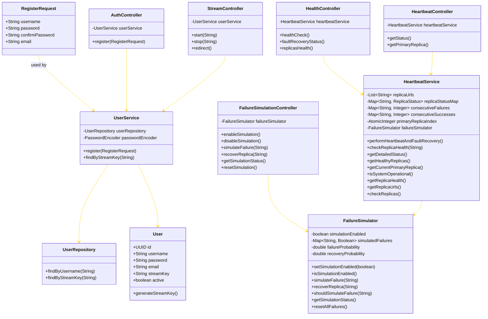

# 🛡️ Fault Recovery with Redundancy

## 📋 Description

This project demonstrates the implementation of **fault recovery architectural tactics** using **active redundancy** in a distributed system. The system implements:

- 🔄 **Active Redundancy**: Multiple service replicas running simultaneously with load balancing
- 🔍 **Fault Detection**: Heartbeat monitoring to detect failed replicas in real-time
- ⚡ **Automatic Recovery**: Docker Swarm's built-in orchestration for replica replacement
- 🔗 **Service Continuity**: Maintaining streaming service availability during failures
- 🖥️ **Cross-Processor Distribution**: Replicas distributed across different containers/processors

## 💡 Motivation

This project simulates a **critical user registration and stream key validation service** where service availability is paramount. The system uses **Docker Swarm** to deploy multiple replicas of a Spring Boot application, implementing **active redundancy** with automatic failover capabilities. When one replica fails, the system automatically detects the failure through **integrated heartbeat monitoring** and routes traffic to healthy replicas without service interruption.

**Non-deterministic failure simulation** is implemented through an integrated `FailureSimulator` service, which can simulate random or controlled failures for testing purposes, replicating real-world scenarios like hardware failures or network partitions.

This project demonstrates:

- 🏗️ The practical implementation of fault recovery tactics in a **Spring Boot microservice architecture**
- 🔄 How to use **active redundancy with automatic failover** in a working distributed system
- ❤️ How **heartbeat monitoring and threshold-based fault detection** can be implemented and tested in a containerized environment
- 🧪 **Integration of chaos engineering** principles through the `FailureSimulator` for comprehensive testing.

## ⚡ Quick Start

```bash
cd app
mvn compile
mvn test
```

## 🏛️ Architecture

### 🧩 Components Diagram


### 📊 Class Diagram


---

## 💻 Implementation Details

### 📦 Package Structure

The fault recovery system is implemented using the following Java package structure:

- 🚀 **Main Application**: `com.swen755.fault_recovery_redundancy.FaultRecoveryRedundancyApplication`
- ⚙️ **Core Services**:
  - `com.swen755.fault_recovery_redundancy.service.HeartbeatService` - Main fault recovery orchestrator
  - `com.swen755.fault_recovery_redundancy.service.FailureSimulator` - Chaos engineering and testing
  - `com.swen755.fault_recovery_redundancy.service.UserService` - User management and authentication
- 🌐 **REST Controllers**:
  - `com.swen755.fault_recovery_redundancy.controller.HealthController` - Health check endpoints
  - `com.swen755.fault_recovery_redundancy.controller.HeartbeatController` - Heartbeat monitoring API
  - `com.swen755.fault_recovery_redundancy.controller.FailureSimulationController` - Chaos testing endpoints
  - `com.swen755.fault_recovery_redundancy.controller.AuthController` - User registration
  - `com.swen755.fault_recovery_redundancy.controller.StreamController` - Stream validation
- 🔒 **Configuration**: `com.swen755.fault_recovery_redundancy.config.SecurityConfig` - Security and endpoint access

### 🔧 Key Configuration Properties

```properties
# Fault Recovery Configuration
fault.recovery.replica.urls=http://spring-boot-app-primary:8080/health,http://spring-boot-app-secondary:8080/health
fault.recovery.heartbeat.interval=10000
fault.recovery.failure.threshold=3
fault.recovery.recovery.threshold=2
fault.recovery.health.timeout=5000

# Failure Simulation Configuration (for testing)
fault.recovery.simulation.enabled=false
fault.recovery.simulation.failure.probability=0.1
fault.recovery.simulation.recovery.probability=0.3
```

### 🐳 Docker Configuration

- 📄 **Docker Compose**: `compose.yaml` - Single node development setup
- 🐝 **Docker Swarm**: `docker-stack.yml` - Multi-node production deployment with service discovery
- 🩺 **Health Check Endpoints**: All containers expose `/health` endpoints for Docker health checks

---

## 🚀 Getting Started

### 📋 Prerequisites

- ☕ Java 17+
- 🔧 Maven
- 💻 An IDE like IntelliJ IDEA or Eclipse
- 🐳 Docker
- 📹 Streaming client, you can use OBS or ffmpeg on the CLI
- 🎥 A Client to view the stream video, you may use VLC other players or use ffplay on the CLI

### 🔗 Dependencies

The project implements fault recovery with redundancy using the following components:

- 🍃 **Spring Boot Applications**: Two replica instances (in `app/` directory) that serve as the critical process requiring fault tolerance. Each replica includes an integrated HeartbeatService for monitoring other replicas using REST health checks.
- 🎲 **FailureSimulator Service**: Integrated service (`com.swen755.fault_recovery_redundancy.service.FailureSimulator`) that can simulate non-deterministic failures for testing fault recovery mechanisms.
- 🗄️ **MySQL Database**: Shared database for storing user credentials and stream keys with persistent storage to survive container restarts.
- 🎬 **NGINX RTMP Server**: The media server (in `nginx-rtmp/` directory) that handles RTMP streaming, deployed with multiple replicas for high availability.
- 🐝 **Docker Swarm/Compose**: Container orchestration providing automatic load balancing, health checks, and replica management across different processors/containers.

---

## 🏗️ How to Run

### 🐳 Docker Compose (Single Node)

1. 📥 Clone the repository:

   ```bash
   git clone https://github.com/ajbarea/fault-recovery-redundancy.git
   cd fault-recovery-redundancy
   ```

2. 🔨 Build the services using Docker Compose:

   ```bash
   docker compose up -d
   ```

   This will start:
   - 🗄️ **MySQL database** on port 3306
   - 🎬 **NGINX RTMP server** on ports 1935 (RTMP) and 9090 (HTTP)
   - 🍃 **Spring Boot application - Primary replica** on port 8080
   - 🍃 **Spring Boot application - Secondary replica** on port 8081

### 🐝 Docker Swarm (High Availability)

For production environments or to enable high availability with redundancy:

1. 🚀 Initialize Docker Swarm (if not already initialized):

   ```bash
   docker swarm init
   ```

2. 🔨 Build the images:

   ```bash
   docker build -t spring-boot-app:latest ./app
   docker build -t nginx-rtmp-server:latest ./nginx-rtmp
   ```

3. 🚀 Deploy the stack:

   ```bash
   docker stack deploy -c docker-stack.yml streaming-auth
   ```

   This will start:
   - 🗄️ **MySQL database** (1 replica)
   - 🎬 **NGINX RTMP server** (2 replicas) on ports 1935 (RTMP) and 9090 (HTTP)
   - 🍃 **Spring Boot application - Primary replica** (1 replica) on port 8080
   - 🍃 **Spring Boot application - Secondary replica** (1 replica) on port 8081

4. ✅ Verify the services are running:

   ```bash
   docker service ls
   ```

5. 🩺 Check the health status of all replicas:

   ```bash
   curl http://localhost:8080/heartbeat/status
   ```

### 🎮 Using the System

Once your services are running (either via Docker Compose or Docker Swarm), follow these steps:

1. 📝 Register for a streaming key by sending a POST request to `localhost:8080/api/auth/register`. There are many ways that you may do this.
   You may use Postman, Insomnia, etc., or a classic curl command:

   ```bash
   curl -X POST http://localhost:8080/api/auth/register \
     -H "Content-Type: application/json" \
     -d '{
       "username": "yolo2",
       "password": "mySuperSecret",
       "confirmPassword": "mySuperSecret",
       "email": "myEmail2@gmail.com"
     }'
   ```

   You should see a response similar to:

   ```json
   {
     "username": "yolo2",
     "streamKey": "generated-stream-key"
   }
   ```

2. 📋 Copy your stream key. You will need this to paste in obs or ffmpeg to start streaming.
3. 📺 Start streaming using your favorite streaming client (e.g., OBS, ffmpeg) with the RTMP URL:

   ```text
   rtmp://localhost/live
   ```

   In the stream key field, paste your generated stream key.

4. ▶️ Click on start stream in OBS or run the following ffmpeg command:

   ```bash
   ffmpeg -f lavfi -i testsrc2=size=1280x720:rate=30 -f lavfi -i sine=frequency=1000:sample_rate=44100 -c:v libx264 -preset veryfast -c:a aac -f flv rtmp://localhost/live/<your-stream-key>
   ```

5. 👀 View the stream using a media player that supports HLS (e.g., VLC, ffplay) with the URL:

   ```text
   http://localhost:9090/live/stream_<your-username>/index.m3u8

   Example:
   http://localhost:9090/live/stream_yolo2/index.m3u8
   ```

---

## ⚡ Fault Recovery Tactics Demonstrated

This project demonstrates the following fault recovery tactics in a distributed streaming system:

- 🔄 **Active Redundancy**: Multiple service replicas running simultaneously with automatic load balancing and failover
- ❤️ **Heartbeat Monitoring**: Continuous health checks of all service replicas to detect failures in real-time
- ⚡ **Automatic Failover**: Docker Swarm orchestration automatically routes traffic away from failed replicas
- 🔍 **Service Discovery**: Dynamic discovery and routing to healthy replicas without manual intervention
- 🛠️ **Self-Healing**: Automatic restart and replacement of failed containers to maintain desired replica count
- 📉 **Graceful Degradation**: System continues to operate with reduced capacity during partial failures
- 🔒 **Fault Isolation**: Container-based isolation prevents failures from cascading across the system

## 🔍 API Endpoints & Fault Recovery Features

| Endpoint | Method | Description | Fault Recovery Feature |
|----------|--------|-------------|------------------------|
| `/` or `/health` | GET | Health check endpoint for individual replicas | ✅ Fault Detection |
| `/api/auth/register` | POST | Register new user and generate stream key | ✅ Load Balanced across replicas |
| `/api/stream/start` | POST | Validate stream key during NGINX on_publish (param: `name`) | ✅ Active Redundancy |
| `/api/stream/stop` | POST | Validate stream key during NGINX on_publish_done (param: `name`) | ✅ Active Redundancy |
| `/heartbeat/status` | GET | Get health status of all application replicas | ✅ System-wide Health Monitoring |
| `/heartbeat/primary` | GET | Get current primary replica information | ✅ Primary Replica Tracking |
| `/health/status` | GET | Get detailed fault recovery status | ✅ Fault Recovery Dashboard |
| `/health/replicas` | GET | Get detailed health status of all replicas | ✅ Replica Health Monitoring |
| `/simulation/enable` | POST | Enable failure simulation for testing | ✅ Fault Testing |
| `/simulation/disable` | POST | Disable failure simulation | ✅ Fault Testing |
| `/simulation/fail/{replicaUrl}` | POST | Manually simulate failure for specific replica | ✅ Controlled Testing |
| `/simulation/recover/{replicaUrl}` | POST | Manually recover replica from simulated failure | ✅ Recovery Testing |
| `/simulation/status` | GET | Get current failure simulation status | ✅ Testing Status |
| `/simulation/reset` | POST | Reset all simulated failures | ✅ Testing Reset |

### 📝 Registration Request Format

```json
{
  "username": "your_username",
  "password": "your_password", 
  "confirmPassword": "your_password",
  "email": "your_email@example.com"
}
```

### 📤 Registration Response Format

```json
{
  "username": "your_username",
  "streamKey": "generated-16-char-key"
}
```

## 🧪 Testing Fault Recovery

You can test the fault recovery system by:

1. 🩺 **Health Check**: Verify all replicas are running

   ```bash
   curl http://localhost:8080/heartbeat/status
   ```

2. 🔗 **Service Continuity**: Register a new user during normal operation

   ```bash
   curl -X POST http://localhost:8080/api/auth/register \
     -H "Content-Type: application/json" \
     -d '{
       "username": "testuser",
       "password": "testpass123",
       "confirmPassword": "testpass123", 
       "email": "test@example.com"
     }'
   ```

3. 🎲 **Failure Simulation using FailureSimulator**: Simulate failures for controlled testing

   ```bash
   # Enable failure simulation
   curl -X POST http://localhost:8080/simulation/enable
   
   # Manually simulate failure for a specific replica
   curl -X POST http://localhost:8080/simulation/fail/http-__spring-boot-app-primary-8080_health
   
   # Check simulation status
   curl http://localhost:8080/simulation/status
   ```

4. 💥 **Physical Failure Simulation**: Scale down replicas to simulate actual failure (Docker Swarm only)

   ```bash
   # Simulate failure by reducing replicas
   docker service scale streaming-auth_spring-boot-app-primary=0
   ```

5. 🔍 **Fault Detection**: Verify heartbeat detects the failure

   ```bash
   curl http://localhost:8080/heartbeat/status
   ```

6. 🛡️ **Service Resilience**: Verify service continues to work with remaining replicas

   ```bash
   # Registration should still work with remaining replicas
   curl -X POST http://localhost:8081/api/auth/register \
     -H "Content-Type: application/json" \
     -d '{
       "username": "resilient_user",
       "email": "resilient@example.com"
     }'
   ```

7. 🔄 **Recovery Testing**: Restore full capacity and verify automatic recovery

   ```bash
   # For simulation-based failures:
   curl -X POST http://localhost:8080/simulation/recover/http-__spring-boot-app-primary-8080_health
   curl -X POST http://localhost:8080/simulation/disable
   
   # Reset all simulated failures (optional)
   curl -X POST http://localhost:8080/simulation/reset
   
   # For Docker Swarm failures:
   docker service scale streaming-auth_spring-boot-app-primary=1
   
   # Verify recovery
   curl http://localhost:8080/heartbeat/status
   ```

## 📚 References

- 🐳 [Docker Swarm Documentation](https://docs.docker.com/engine/swarm/)
- 🍃 [Spring Boot Actuator Health Checks](https://docs.spring.io/spring-boot/docs/current/reference/html/actuator.html)
- 🛡️ [Fault Tolerance Patterns](https://martinfowler.com/articles/patterns-of-resilience.html)
- 🏗️ [Container Orchestration and Fault Recovery](https://kubernetes.io/docs/concepts/architecture/)
- 📖 [Building Resilient Microservices](https://www.oreilly.com/library/view/building-microservices/9781491950340/)
- ❤️ [Heartbeat Monitoring Patterns](https://microservices.io/patterns/observability/health-check-api.html)

## 🔄 Redundancy & Heartbeat Monitoring

This project implements Docker Swarm-based redundancy with integrated heartbeat monitoring to provide high availability and fault tolerance:

### 🔄 Redundancy Features

- 🍃 **Multiple Spring Boot Replicas**: The application runs with two separate replicas (primary and secondary) to ensure continuous service even if one instance fails
- ⚖️ **Docker Swarm Load Balancing**: Automatic distribution of traffic across healthy replicas
- ⚡ **Automatic Failover**: When a replica fails its health check, the HeartbeatService automatically promotes a healthy replica as the new primary
- 🛠️ **Self-healing**: Failed containers are automatically restarted by Docker Swarm
- 🎯 **Threshold-based Detection**: Configurable failure and recovery thresholds prevent false positives

### ❤️ Heartbeat Monitoring

Each Spring Boot replica includes an integrated HeartbeatService that provides:

- 🕐 **Periodic Health Checks**: Checks the health of all replicas every 10 seconds (configurable)
- 👑 **Primary Replica Management**: Tracks and automatically fails over the primary replica when necessary
- ❌ **Failure Threshold Detection**: Requires multiple consecutive failures before marking a replica as DOWN
- ✅ **Recovery Threshold Detection**: Requires multiple consecutive successes before marking a replica as UP
- 📋 **Event Logging**: Records all failover events with timestamps for audit purposes
- 📊 **Status Dashboard**: Exposes multiple endpoints for monitoring system health
- 🧪 **Integration with FailureSimulator**: Supports controlled chaos engineering for testing fault recovery

### 📊 Heartbeat Status Response Format

```json
{
  "system_status": "operational",
  "healthy_replicas": 2,
  "total_replicas": 2,
  "primary_replica": "http://spring-boot-app-primary:8080/health",
  "primary_replica_index": 0,
  "replicas": {
    "replica_0": {
      "status": "UP",
      "url": "http://spring-boot-app-primary:8080/health",
      "is_primary": true,
      "consecutive_failures": 0,
      "consecutive_successes": 5,
      "last_checked": "2025-01-18T10:30:45"
    },
    "replica_1": {
      "status": "UP",
      "url": "http://spring-boot-app-secondary:8080/health",
      "is_primary": false,
      "consecutive_failures": 0,
      "consecutive_successes": 5,
      "last_checked": "2025-01-18T10:30:45"
    }
  },
  "recent_failover_events": [
    {
      "timestamp": "2025-01-18T10:25:30",
      "replica_url": "http://spring-boot-app-primary:8080/health",
      "event_type": "RECOVERY",
      "description": "Replica marked as UP after 3 consecutive successes"
    }
  ]
}
```

### 🧪 Testing Failover

You can test the failover capability by:

1. ✅ Check the current status of all replicas:
   ```bash
   curl http://localhost:8080/heartbeat/status
   ```

2. 💥 Simulate a failure by stopping one of the Spring Boot replicas:
   ```bash
   docker service scale streaming-auth_spring-boot-app-primary=0
   ```

3. 🔍 Check the heartbeat status again to see the change:
   ```bash
   curl http://localhost:8081/heartbeat/status
   ```

4. ✨ Verify that the streaming service continues to work despite the failure

5. 🔄 Restore the full capacity:
   ```bash
   docker service scale streaming-auth_spring-boot-app-primary=1
   ```