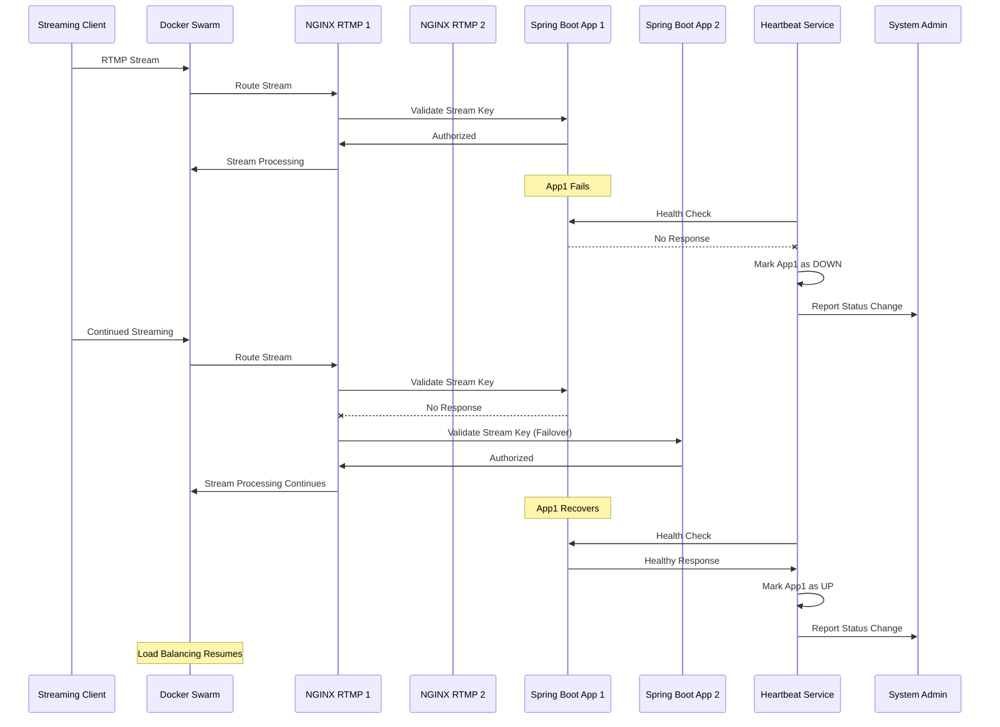

```mermaid
sequenceDiagram
    participant Client as Streaming Client
    participant Swarm as Docker Swarm
    participant RTMP1 as NGINX RTMP 1
    participant RTMP2 as NGINX RTMP 2
    participant App1 as Spring Boot App 1
    participant App2 as Spring Boot App 2
    participant HB as Heartbeat Service
    participant Admin as System Admin

    Client->>Swarm: RTMP Stream
    Swarm->>RTMP1: Route Stream
    RTMP1->>App1: Validate Stream Key
    App1->>RTMP1: Authorized
    RTMP1->>Swarm: Stream Processing

    Note over App1: App1 Fails

    HB->>App1: Health Check
    App1--xHB: No Response
    HB->>HB: Mark App1 as DOWN
    HB->>Admin: Report Status Change

    Client->>Swarm: Continued Streaming
    Swarm->>RTMP1: Route Stream
    RTMP1->>App1: Validate Stream Key
    App1--xRTMP1: No Response
    RTMP1->>App2: Validate Stream Key (Failover)
    App2->>RTMP1: Authorized
    RTMP1->>Swarm: Stream Processing Continues

    Note over App1: App1 Recovers

    HB->>App1: Health Check
    App1->>HB: Healthy Response
    HB->>HB: Mark App1 as UP
    HB->>Admin: Report Status Change

    Note over Swarm: Load Balancing Resumes
```
