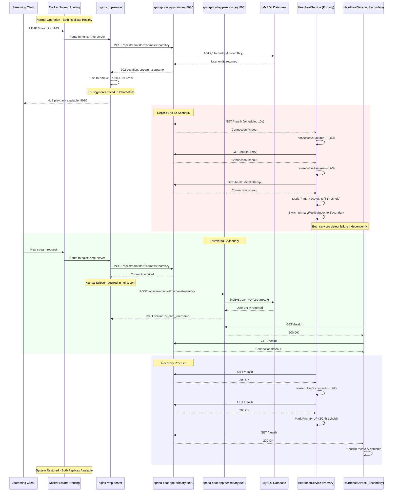

# Failover Flow Sequence Diagram

```mermaid
sequenceDiagram
    participant Client as Streaming Client
    participant Swarm as Docker Swarm Routing
    participant NGINX as nginx-rtmp-server
    participant Primary as spring-boot-app-primary:8080
    participant Secondary as spring-boot-app-secondary:8081
    participant MySQL as MySQL Database
    participant HS1 as HeartbeatService (Primary)
    participant HS2 as HeartbeatService (Secondary)

    Note over Swarm: Normal Operation - Both Replicas Healthy
    
    Client->>Swarm: RTMP Stream to :1935
    Swarm->>NGINX: Route to nginx-rtmp-server
    NGINX->>Primary: POST /api/stream/start?name=streamKey
    Primary->>MySQL: findByStreamKey(streamKey)
    MySQL-->>Primary: User entity returned
    Primary-->>NGINX: 302 Location: stream_username
    NGINX->>NGINX: Push to rtmp://127.0.0.1:1935/hls
    Note over NGINX: HLS segments saved to /shared/live
    NGINX-->>Client: HLS playback available :9090

    rect rgb(255, 240, 240)
        Note over Primary: Replica Failure Scenario
        
        HS1->>Primary: GET /health (scheduled 10s)
        Primary--xHS1: Connection timeout
        HS1->>HS1: consecutiveFailures++ (1/3)
        
        HS1->>Primary: GET /health (retry)
        Primary--xHS1: Connection timeout  
        HS1->>HS1: consecutiveFailures++ (2/3)
        
        HS1->>Primary: GET /health (final attempt)
        Primary--xHS1: Connection timeout
        HS1->>HS1: Mark Primary DOWN (3/3 threshold)
        HS1->>HS1: Switch primaryReplicaIndex to Secondary
        
        Note over HS1,HS2: Both services detect failure independently
    end

    rect rgb(240, 255, 240)
        Note over Secondary: Failover to Secondary
        
        Client->>Swarm: New stream request
        Swarm->>NGINX: Route to nginx-rtmp-server
        NGINX->>Primary: POST /api/stream/start?name=streamKey
        Primary--xNGINX: Connection failed
        
        Note over NGINX: Manual failover required in nginx.conf
        NGINX->>Secondary: POST /api/stream/start?name=streamKey
        Secondary->>MySQL: findByStreamKey(streamKey)
        MySQL-->>Secondary: User entity returned
        Secondary-->>NGINX: 302 Location: stream_username
        
        HS2->>Secondary: GET /health
        Secondary-->>HS2: 200 OK
        HS2->>Primary: GET /health
        Primary--xHS2: Connection timeout
    end

    rect rgb(240, 240, 255)
        Note over Primary: Recovery Process
        
        HS1->>Primary: GET /health
        Primary-->>HS1: 200 OK
        HS1->>HS1: consecutiveSuccesses++ (1/2)
        
        HS1->>Primary: GET /health  
        Primary-->>HS1: 200 OK
        HS1->>HS1: Mark Primary UP (2/2 threshold)
        
        HS2->>Primary: GET /health
        Primary-->>HS2: 200 OK
        HS2->>HS2: Confirm recovery detected
    end

    Note over Swarm: System Restored - Both Replicas Available
```
