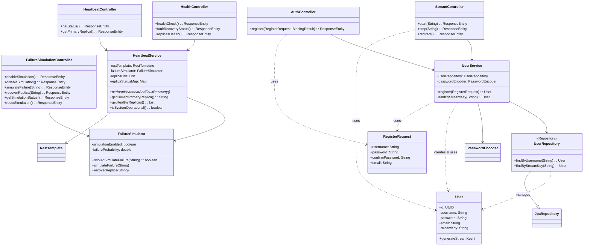

# Livestreaming Class Diagram

```mermaid
classDiagram
    title Fault Recovery and Redundancy System

    class AuthController {
        +register(RegisterRequest, BindingResult): ResponseEntity
    }
    class FailureSimulationController {
        +enableSimulation(): ResponseEntity
        +disableSimulation(): ResponseEntity
        +simulateFailure(String): ResponseEntity
        +recoverReplica(String): ResponseEntity
        +getSimulationStatus(): ResponseEntity
        +resetSimulation(): ResponseEntity
    }
    class HealthController {
        +healthCheck(): ResponseEntity
        +faultRecoveryStatus(): ResponseEntity
        +replicasHealth(): ResponseEntity
    }
    class HeartbeatController {
        +getStatus(): ResponseEntity
        +getPrimaryReplica(): ResponseEntity
    }
    class StreamController {
        +start(String): ResponseEntity
        +stop(String): ResponseEntity
        +redirect(): ResponseEntity
    }

    class UserService {
        -userRepository: UserRepository
        -passwordEncoder: PasswordEncoder
        +register(RegisterRequest): User
        +findByStreamKey(String): User
    }
    class HeartbeatService {
        -restTemplate: RestTemplate
        -failureSimulator: FailureSimulator
        -replicaUrls: List
        -replicaStatusMap: Map
        +performHeartbeatAndFaultRecovery()*
        +getCurrentPrimaryReplica(): String
        +getHealthyReplicas(): List
        +isSystemOperational(): boolean
    }
    class FailureSimulator {
        -simulationEnabled: boolean
        -failureProbability: double
        +shouldSimulateFailure(String): boolean
        +simulateFailure(String)
        +recoverReplica(String)
    }

    class User {
        -id: UUID
        -username: String
        -password: String
        -email: String
        -streamKey: String
        +generateStreamKey()
    }
    class RegisterRequest {
        +username: String
        +password: String
        +confirmPassword: String
        +email: String
    }
    class UserRepository {
        +findByUsername(String): User
        +findByStreamKey(String): User
    }
    <<Repository>> UserRepository
    
    class JpaRepository
    class RestTemplate
    class PasswordEncoder

    %% --- Relationships ---

    %% Controller Dependencies
    AuthController --> UserService
    FailureSimulationController --> FailureSimulator
    HealthController --> HeartbeatService
    HeartbeatController --> HeartbeatService
    StreamController --> UserService

    %% Service Dependencies
    UserService --> UserRepository
    UserService --> PasswordEncoder
    HeartbeatService --> FailureSimulator
    HeartbeatService --> RestTemplate

    %% Data Layer
    UserService ..> User : creates & uses
    StreamController ..> User : uses
    UserRepository ..> User : manages
    UserRepository --|> JpaRepository

    %% DTO Usage
    AuthController ..> RegisterRequest : uses
    UserService ..> RegisterRequest : uses
```
