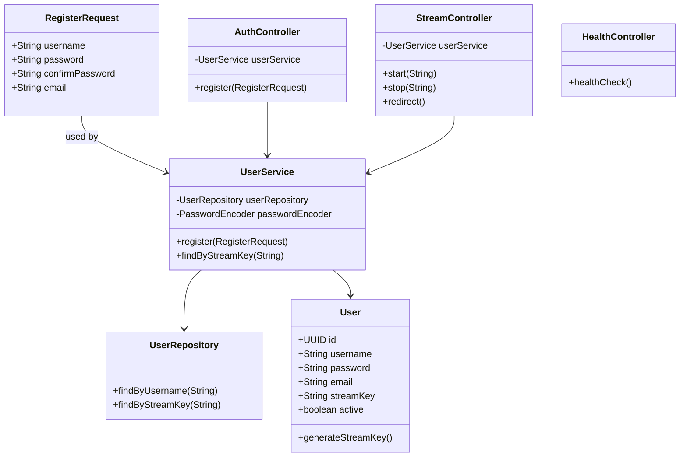

```mermaid
classDiagram
    class RegisterRequest {
        +String username
        +String password
        +String confirmPassword
        +String email
    }

    class User {
        +UUID id
        +String username
        +String password
        +String email
        +String streamKey
        +boolean active
        +generateStreamKey()
    }

    class UserRepository {
        +findByUsername(String)
        +findByStreamKey(String)
    }

    class UserService {
        -UserRepository userRepository
        -PasswordEncoder passwordEncoder
        +register(RegisterRequest)
        +findByStreamKey(String)
    }

    class AuthController {
        -UserService userService
        +register(RegisterRequest)
    }

    class StreamController {
        -UserService userService
        +start(String)
        +stop(String)
        +redirect()
    }

    class HealthController {
        +healthCheck()
    }

    RegisterRequest --> UserService : used by
    UserService --> UserRepository
    UserService --> User
    AuthController --> UserService
    StreamController --> UserService
```