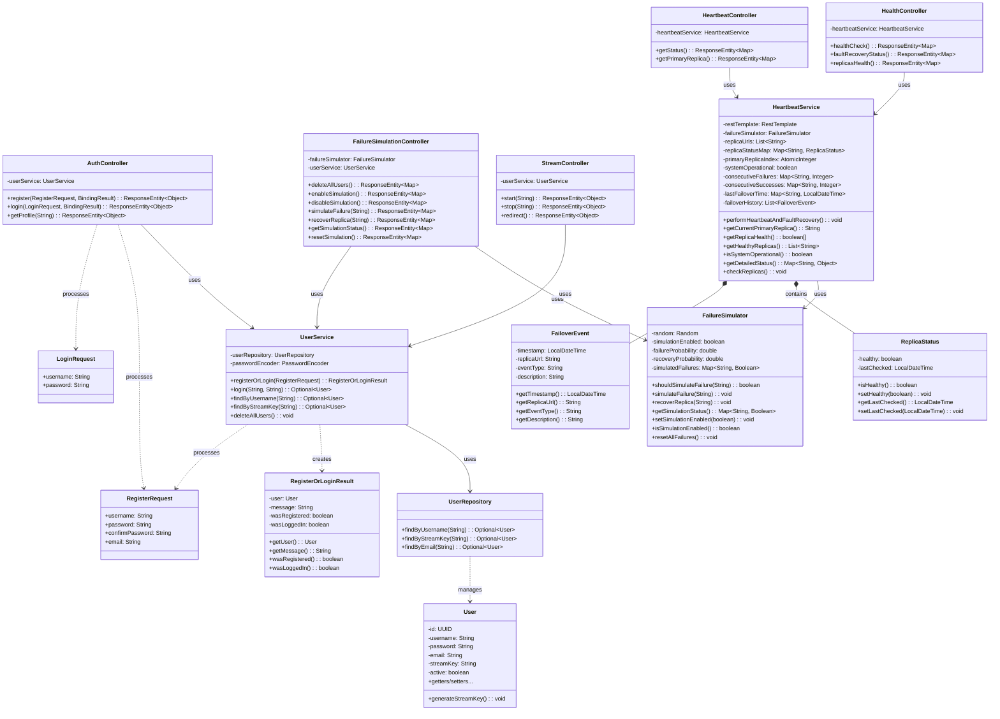

# Fault Recovery System Class Diagram

```mermaid
classDiagram
    title Fault Recovery and Redundancy System

    class AuthController {
        -userService: UserService
        +register(RegisterRequest, BindingResult): ResponseEntity~Object~
        +login(LoginRequest, BindingResult): ResponseEntity~Object~
        +getProfile(String): ResponseEntity~Object~
    }
    
    class FailureSimulationController {
        -failureSimulator: FailureSimulator
        -userService: UserService
        +deleteAllUsers(): ResponseEntity~Map~
        +enableSimulation(): ResponseEntity~Map~
        +disableSimulation(): ResponseEntity~Map~
        +simulateFailure(String): ResponseEntity~Map~
        +recoverReplica(String): ResponseEntity~Map~
        +getSimulationStatus(): ResponseEntity~Map~
        +resetSimulation(): ResponseEntity~Map~
    }
    
    class HealthController {
        -heartbeatService: HeartbeatService
        +healthCheck(): ResponseEntity~Map~
        +faultRecoveryStatus(): ResponseEntity~Map~
        +replicasHealth(): ResponseEntity~Map~
    }
    
    class HeartbeatController {
        -heartbeatService: HeartbeatService
        +getStatus(): ResponseEntity~Map~
        +getPrimaryReplica(): ResponseEntity~Map~
    }
    
    class StreamController {
        -userService: UserService
        +start(String): ResponseEntity~Object~
        +stop(String): ResponseEntity~Object~
        +redirect(): ResponseEntity~Object~
    }

    class UserService {
        -userRepository: UserRepository
        -passwordEncoder: PasswordEncoder
        +registerOrLogin(RegisterRequest): RegisterOrLoginResult
        +login(String, String): Optional~User~
        +findByUsername(String): Optional~User~
        +findByStreamKey(String): Optional~User~
        +deleteAllUsers(): void
    }
    
    class RegisterOrLoginResult {
        -user: User
        -message: String
        -wasRegistered: boolean
        -wasLoggedIn: boolean
        +getUser(): User
        +getMessage(): String
        +wasRegistered(): boolean
        +wasLoggedIn(): boolean
    }
    
    class HeartbeatService {
        -restTemplate: RestTemplate
        -failureSimulator: FailureSimulator
        -replicaUrls: List~String~
        -replicaStatusMap: Map~String, ReplicaStatus~
        -primaryReplicaIndex: AtomicInteger
        -systemOperational: boolean
        -consecutiveFailures: Map~String, Integer~
        -consecutiveSuccesses: Map~String, Integer~
        -lastFailoverTime: Map~String, LocalDateTime~
        -failoverHistory: List~FailoverEvent~
        +performHeartbeatAndFaultRecovery(): void
        +getCurrentPrimaryReplica(): String
        +getReplicaHealth(): boolean[]
        +getHealthyReplicas(): List~String~
        +isSystemOperational(): boolean
        +getDetailedStatus(): Map~String, Object~
        +checkReplicas(): void
    }
    
    class FailureSimulator {
        -random: Random
        -simulationEnabled: boolean
        -failureProbability: double
        -recoveryProbability: double
        -simulatedFailures: Map~String, Boolean~
        +shouldSimulateFailure(String): boolean
        +simulateFailure(String): void
        +recoverReplica(String): void
        +getSimulationStatus(): Map~String, Boolean~
        +setSimulationEnabled(boolean): void
        +isSimulationEnabled(): boolean
        +resetAllFailures(): void
    }

    class User {
        -id: UUID
        -username: String
        -password: String
        -email: String
        -streamKey: String
        -active: boolean
        +generateStreamKey(): void
        +getters/setters...
    }
    
    class RegisterRequest {
        +username: String
        +password: String
        +confirmPassword: String
        +email: String
    }
    
    class LoginRequest {
        +username: String
        +password: String
    }
    
    class UserRepository {
        +findByUsername(String): Optional~User~
        +findByStreamKey(String): Optional~User~
        +findByEmail(String): Optional~User~
    }
    
    class ReplicaStatus {
        -healthy: boolean
        -lastChecked: LocalDateTime
        +isHealthy(): boolean
        +setHealthy(boolean): void
        +getLastChecked(): LocalDateTime
        +setLastChecked(LocalDateTime): void
    }
    
    class FailoverEvent {
        -timestamp: LocalDateTime
        -replicaUrl: String
        -eventType: String
        -description: String
        +getTimestamp(): LocalDateTime
        +getReplicaUrl(): String
        +getEventType(): String
        +getDescription(): String
    }

    %% Relationships
    AuthController --> UserService : uses
    FailureSimulationController --> FailureSimulator : uses
    FailureSimulationController --> UserService : uses
    HealthController --> HeartbeatService : uses
    HeartbeatController --> HeartbeatService : uses
    StreamController --> UserService : uses
    
    UserService --> UserRepository : uses
    UserService ..> RegisterOrLoginResult : creates
    HeartbeatService --> FailureSimulator : uses
    HeartbeatService *-- ReplicaStatus : contains
    HeartbeatService *-- FailoverEvent : contains
    
    UserRepository ..> User : manages
    AuthController ..> RegisterRequest : processes
    AuthController ..> LoginRequest : processes
    UserService ..> RegisterRequest : processes
```
