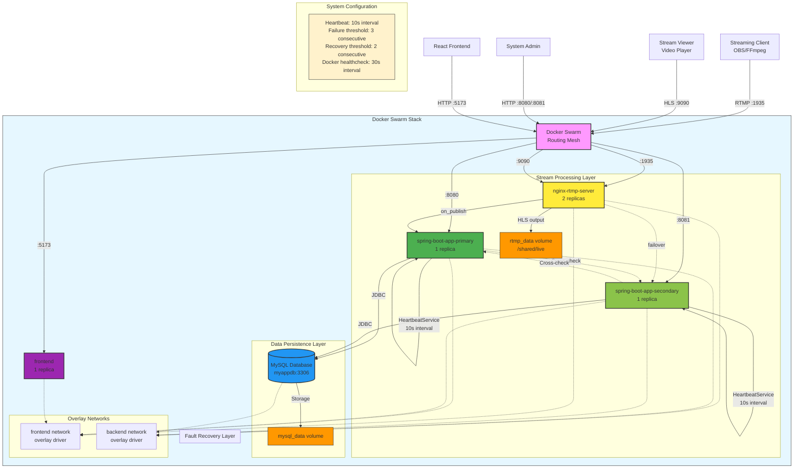

# Docker Swarm Architecture Diagram

```mermaid
graph TB
    Client[Streaming Client<br/>OBS/FFmpeg] -->|RTMP :1935| SwarmLB[Docker Swarm<br/>Routing Mesh]
    Viewer[Stream Viewer<br/>Video Player] -->|HLS :9090| SwarmLB
    Admin[System Admin] -->|HTTP :8080/:8081| SwarmLB
    Frontend[React Frontend] -->|HTTP :5173| SwarmLB
    
    subgraph SwarmCluster[Docker Swarm Stack]
        SwarmLB -->|:1935| NGINX[nginx-rtmp-server<br/>2 replicas]
        SwarmLB -->|:9090| NGINX
        SwarmLB -->|:8080| PRIMARY[spring-boot-app-primary<br/>1 replica]
        SwarmLB -->|:8081| SECONDARY[spring-boot-app-secondary<br/>1 replica]
        SwarmLB -->|:5173| FRONTEND[frontend<br/>1 replica]
        
        subgraph StreamProcessing[Stream Processing Layer]
            NGINX -->|on_publish| PRIMARY
            NGINX -.->|failover| SECONDARY
            NGINX -->|HLS output| SHARED[rtmp_data volume<br/>/shared/live]
        end
        
        subgraph FaultRecovery[Fault Recovery Layer]
            PRIMARY -->|HeartbeatService<br/>10s interval| PRIMARY
            SECONDARY -->|HeartbeatService<br/>10s interval| SECONDARY
            PRIMARY -.->|Cross-check| SECONDARY
            SECONDARY -.->|Cross-check| PRIMARY
        end
        
        subgraph DataPersistence[Data Persistence Layer]
            PRIMARY -->|JDBC| MYSQL[(MySQL Database<br/>myappdb:3306)]
            SECONDARY -->|JDBC| MYSQL
            MYSQL -->|Storage| MYSQL_VOL[mysql_data volume]
        end
        
        subgraph Networks[Overlay Networks]
            FE_NET[frontend network<br/>overlay driver]
            BE_NET[backend network<br/>overlay driver]
        end
    end
    
    subgraph ConfigParams[System Configuration]
        CONFIG["Heartbeat: 10s interval<br/>Failure threshold: 3 consecutive<br/>Recovery threshold: 2 consecutive<br/>Docker healthcheck: 30s interval"]
    end
    
    %% Network assignments
    FRONTEND -.-> FE_NET
    NGINX -.-> FE_NET
    NGINX -.-> BE_NET
    PRIMARY -.-> FE_NET
    PRIMARY -.-> BE_NET
    SECONDARY -.-> FE_NET  
    SECONDARY -.-> BE_NET
    MYSQL -.-> BE_NET
    
    %% Styling
    style SwarmLB fill:#f9f,stroke:#333,stroke-width:2px
    style SwarmCluster fill:#e6f7ff,stroke:#333,stroke-width:1px
    style NGINX fill:#ffeb3b,stroke:#333,stroke-width:2px
    style PRIMARY fill:#4caf50,stroke:#333,stroke-width:2px
    style SECONDARY fill:#8bc34a,stroke:#333,stroke-width:2px
    style MYSQL fill:#2196f3,stroke:#333,stroke-width:2px
    style SHARED fill:#ff9800,stroke:#333,stroke-width:1px
    style MYSQL_VOL fill:#ff9800,stroke:#333,stroke-width:1px
    style CONFIG fill:#fff2cc,stroke:#333,stroke-width:1px
    style FRONTEND fill:#9c27b0,stroke:#333,stroke-width:2px
```
