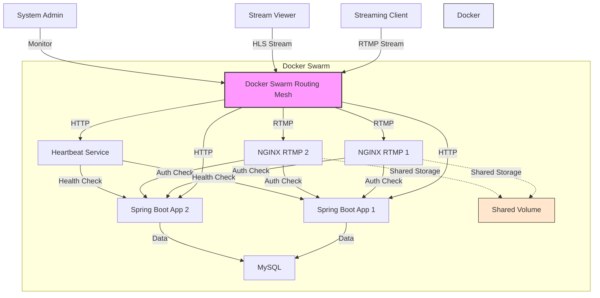

```mermaid
graph TD
    Client[Streaming Client] -->|RTMP Stream| LB[Docker Swarm Routing Mesh]
    Viewer[Stream Viewer] -->|HLS Stream| LB
    Admin[System Admin] -->|Monitor| LB
    
    subgraph Docker Swarm
        LB -->|RTMP| RTMP1[NGINX RTMP 1]
        LB -->|RTMP| RTMP2[NGINX RTMP 2]
        LB -->|HTTP| APP1[Spring Boot App 1]
        LB -->|HTTP| APP2[Spring Boot App 2]
        LB -->|HTTP| HB[Heartbeat Service]
        
        RTMP1 -->|Auth Check| APP1
        RTMP1 -->|Auth Check| APP2
        RTMP2 -->|Auth Check| APP1
        RTMP2 -->|Auth Check| APP2
        
        HB -->|Health Check| APP1
        HB -->|Health Check| APP2
        
        APP1 -->|Data| DB[MySQL]
        APP2 -->|Data| DB
        
        RTMP1 -.->|Shared Storage| VOL[Shared Volume]
        RTMP2 -.->|Shared Storage| VOL
    end
    
    style LB fill:#f9f,stroke:#333,stroke-width:2px
    style Docker Swarm fill:#e6f7ff,stroke:#333,stroke-width:1px
    style VOL fill:#ffe6cc,stroke:#333,stroke-width:1px
```
